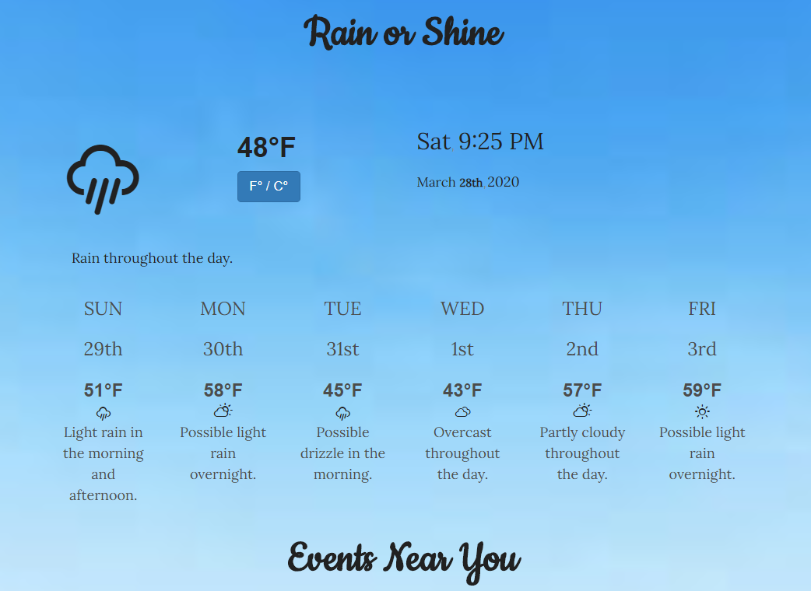

# Rain or Shine 

https://khny258.github.io/Rain-or-Shine/

<strong>Desktop</strong>
 

 
 

# About Us

New York is one of the most active cities in the world where there’s always an event to attend, a new pop-up to check out, a seasonal activity to engage in, or a limited time museum exhibit to check out. The problem is that the weather always dictates when it’s better attend indoor or outdoor events, making it hard to find something to do that might be better to check out, depending on the forecast that day. This is where Rain or Shine comes in!

Rain or Shine is an app that will show the user what events they can attend, depending on the weather exclusively for that day and over the next week. This makes for proper planning for the user who wants to find something to do by themselves, or with friends and family members. This would also be useful for visitors who are looking for a genuine New York City experience outside of the usual tourist sites

# Technology

For our APIs, we utilized three.

The weather API, Dark Sky, shows the current conditions outside as well as well as the weather over a six-day period. We also gave users the option to convert the temperature from Celsius to Fahrenheit, depending on who’s utilizing the app.

The event API, Eventful, which we altered to only focus on the New York City metropolitan area within 25 miles from the borough of Manhattan.

As for the location, we used Geolocation API.

<b>The Process – Challenges and Successes</b>

We found success in not only finding APIs that were essential to the app, but we also found a strong benefit in building a button that would alternate between the two measurements of temperature. The most important factor was finding APIs that carried out what we needed them to do.

The major challenge was trying to connect all three APIs to do what we wanted them to do: show outdoor events on sunny days and show indoor events on rainy days. Since these three APIs couldn’t be any different, it was a bit of an effort to get them to work off one another.

Once that was figured out, we then shifted our focus into the layout, giving the building continued success.
 
 
